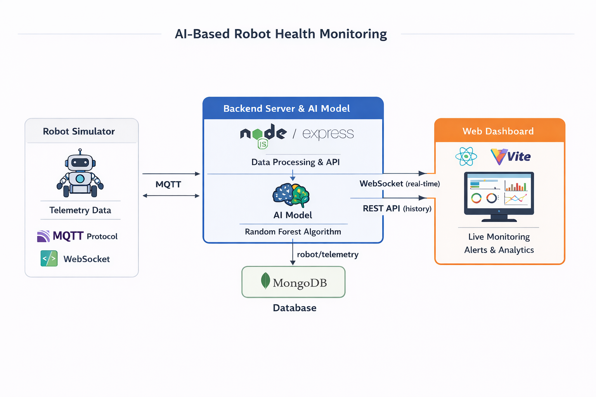

# 🤖 AI-Based Robot Health Monitoring

This project monitors robot health using IoT data and AI. Robots send real-time telemetry data such as battery, motor current, temperature, CPU load, and velocity to a backend server. 
An AI model (Random Forest) detects problems like overheating, battery issues, or abnormal velocity patterns. A web dashboard visualizes live status, warnings, and trends.

## Project Structure
   ```bash
ai-robot-health-monitoring/
│
├── backend/                          # Backend server 
│   ├── config/                       # Database & environment configuration
│   ├── controllers/                  # API request handlers
│   ├── models/                       # MongoDB schemas (Telemetry, User)
│   ├── routes/                       # REST API routes
│   ├── middlewares/                  # Auth & request middlewares
│   │   └── authMiddleware.js         # JWT authentication
│   ├── services/                     # Core application services
│   │   ├── mqttService.js            # MQTT subscriber (robot/telemetry)
│   │   ├── socketService.js          # WebSocket real-time updates
│   │   └── anomalyService.js         # ML integration & predictions
│   ├── utils/                        # Utility helpers
│   │   ├── generateToken.js          # JWT token generation
│   │   ├── hashPassword.js           # Password hashing
│   │   └── logger.js                 # Logging utility
│   ├── ml/                           # Machine Learning
│   │   ├── predict.py                # Loads model & predicts anomalies
│   │   ├── rf_model.joblib           # Trained Random Forest model
│   │   └── scaler.joblib             # Feature scaler 
│   ├── .env                          # Backend environment variables
│   ├── server.js                     # Server entry point
│   └── package.json
│
├── frontend/                         # Web dashboard (React + Vite + Tailwind)
│   ├── src/
│   │   ├── components/               # Reusable UI components
│   │   ├── pages/                    # Application pages
│   │   ├── layouts/                  # Layout wrappers (Dashboard, Auth)
│   │   ├── routes/                   # Routing & protected routes
│   │   │   ├── Router.tsx            # Main router component
│   │   │   └── ProtectedRoute.tsx    # Guards routes for authenticated users
│   │   ├── context/                  # Global state & auth context
│   │   ├── services/                 # API & WebSocket clients
│   │   ├── config/                   # UI theme & app configuration
│   │   ├── lib/                      # Shared helpers & utilities
│   │   ├── types/                    # TypeScript interfaces
│   │   ├── App.tsx
│   │   ├── App.css
│   │   ├── index.css
│   │   └── main.tsx
│   │
│   ├── index.html
│   ├── tailwind.config.js
│   ├── postcss.config.js
│   ├── .env                          # Frontend environment variables
│   ├── vite.config.ts
│   └── package.json
│
├── robot-simulator/                  # Robot telemetry simulator (Python)
│   ├── simulator.py                  # Publishes telemetry via MQTT
│   ├── requirements.txt
│   └── README.md
│
├── docs/                             # Documentation
│   └── architecture.png              # System architecture diagram
│
├── .gitignore
└── README.md
```

## Architecture




The architecture shows how the robot simulator, backend, MQTT broker, AI model, and frontend dashboard communicate in real-time.

## Getting Started

### Environment Variables
This project requires environment variables for both the backend and frontend. Create a .env file in each folder and add the following variables.

### Backend
Create a .env file in the backend/ folder:
   ```bash
MONGO_URI=your_mongodb_connection_string
MQTT_BROKER_URL=your_mqtt_broker_url
MQTT_TOPIC=your_mqtt_topic
PORT=5000
JWT_SECRET=your_jwt_secret
JWT_EXPIRES_IN=1d
```
### Frontend
Create a .env file in the frontend/ folder:
   ```bash
VITE_API_URL=http://localhost:5000
VITE_SOCKET_URL=ws://localhost:5000
```

### Backend
1. Navigate to `backend/`
2. Install dependencies:
   ```bash
   npm install
3. Start the server
   ```bash
   nodemon server.js
   ```
### Frontend
1. Navigate to `frontend/`
2. Install dependencies:
  ```bash
   npm install
```
3. Start the dashboard
  ```bash
   npm run dev
```
### Robot Simulator
1. Navigate to robot-simulator/
2.Install dependencies :
  ```bash
pip install -r requirements.txt
```
3. Run the simulator:
  ```bash
python simulator.py
```

### Features

- Real-time telemetry monitoring (battery, motor current, temperature, CPU load, velocity)

- AI-based anomaly detection using Random Forest

- Web dashboard with live status, trends, and warnings

- Simulated robot data for testing and development
