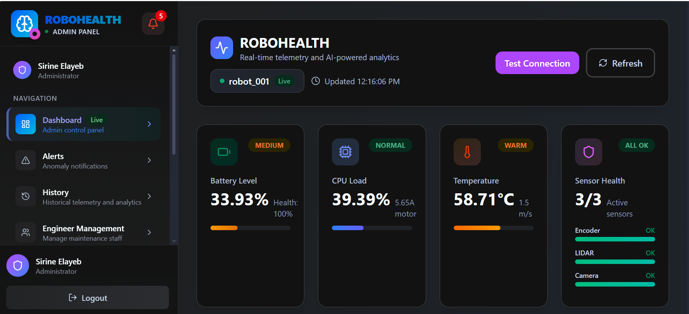
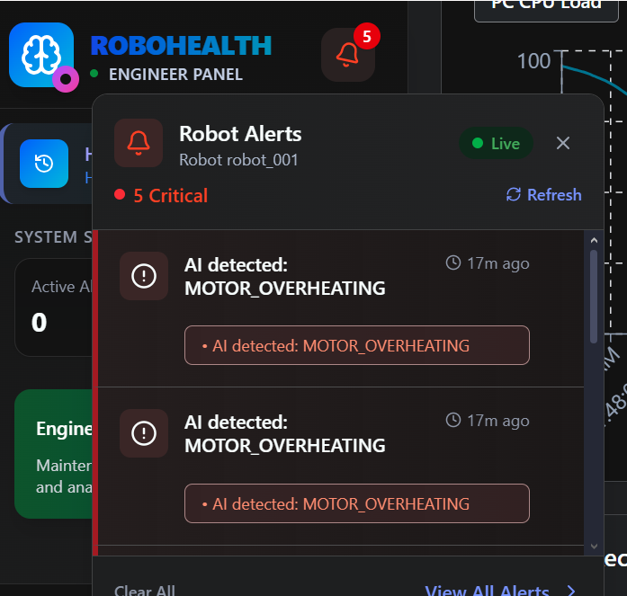
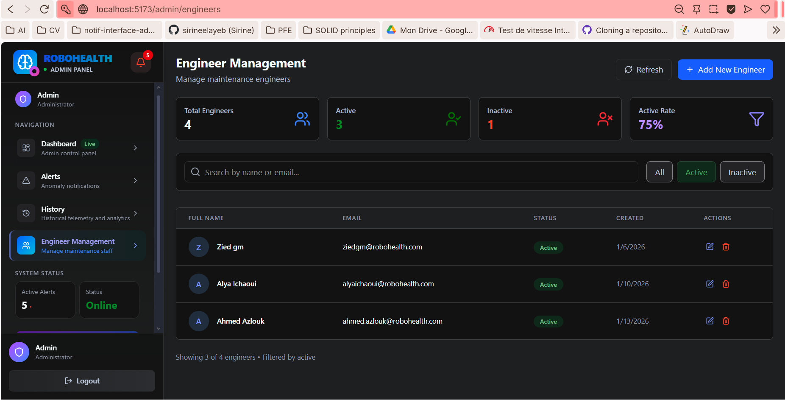

# AI-Based Robot Health Monitoring

A real-time robot health monitoring platform combining IoT telemetry, MQTT communication, and AI-based anomaly detection using XGBoost. The system continuously analyzes robot and system metrics to detect abnormal behavior and potential failures, visualized through an interactive web dashboard.

## Project Objectives

- Monitor robot health in real time
- Detect early anomalies using AI and rule-based logic
- Centralize telemetry data for maintenance and diagnostics
- Provide role-based dashboards for administrators and maintenance engineers
- Demonstrate a full end-to-end IoT + AI architecture

## Telemetry Monitored

### Robot Metrics
- Battery level, health, drop rate, and degradation trend
- Motor temperature and current
- Velocity and CPU load

### Sensor Health
- Encoder status
- LiDAR status
- Camera status

### Embedded PC Metrics
- CPU usage
- Memory usage
- Disk usage
- Network activity
- System temperature

## AI Anomaly Detection (XGBoost)

A trained XGBoost model performs pattern-based anomaly detection on incoming telemetry data:

- **BATTERY_DEGRADATION**: Detects long-term battery health decline patterns
- **ABNORMAL_VELOCITY**: Identifies unusual or unsafe speed behavior
- **MOTOR_OVERHEATING**: Predicts overheating risks based on temperature trends

*Other basic anomalies are handled using rule-based thresholds for fast detection.*

## System Architecture

The system uses a microservices architecture with Docker containers:
```bash

ai-robot-health-monitoring/
├── docker-compose.yml # Docker Compose configuration
├── mosquitto.conf # MQTT broker configuration
├── start-fresh.ps1 # Windows deployment script
├── .gitignore
├── README.md
│
├── backend/ # Node.js backend
│ ├── Dockerfile # Backend Docker image
│ ├── config/
│ │ ├── index.js # App configuration
│ │ └── thresholds.js # Thresholds & detection rules
│ ├── controllers/
│ │ ├── adminController.js # Admin user management
│ │ ├── authController.js # User authentication
│ │ ├── engineerController.js # Engineer management
│ │ ├── mlController.js # ML predictions
│ │ └── telemetryController.js # Telemetry handling
│ ├── middlewares/
│ │ └── authMiddleware.js # JWT authentication
│ ├── models/
│ │ ├── Telemetry.js # Robot data schema
│ │ └── User.js # User schema
│ ├── routes/
│ │ ├── adminRoutes.js # Admin API routes
│ │ ├── alertRoutes.js # Alert API routes
│ │ ├── authRoutes.js # Auth API routes
│ │ ├── engineerRoutes.js # Engineer API routes
│ │ ├── mlRoutes.js # ML API routes
│ │ └── telemetryRoutes.js # Telemetry API routes
│ ├── services/
│ │ ├── mlService.js # ML model integration
│ │ ├── mqttService.js # MQTT client service
│ │ ├── socketService.js # WebSocket real-time updates
│ │ ├── telemetryService.js # Telemetry processing
│ │ └── thresholdService.js # Threshold management
│ ├── ml/
│ │ ├── data/ # Training datasets
│ │ ├── evaluation/ # Model evaluation scripts
│ │ ├── inference/ # Prediction scripts
│ │ ├── preprocessing/ # Data preprocessing
│ │ ├── training/ # Model training scripts
│ │ └── utils/ # ML utilities
│ ├── utils/
│ │ ├── generateToken.js # JWT token generation
│ │ ├── hashPassword.js # Password hashing
│ │ ├── initializeAdmin.js # Admin user initialization
│ │ └── logger.js # Application logging
│ ├── .env # Environment variables
│ ├── server.js # Main application entry point
│ ├── package.json # Node.js dependencies
│ └── requirements.txt # Python ML dependencies
│
├── frontend/ # React dashboard
│ ├── Dockerfile # Frontend Docker image
│ ├── nginx.conf # Nginx configuration
│ ├── src/
│ │ ├── api/ # API client services
│ │ ├── components/ # Reusable UI components
│ │ │ ├── cards/ # Telemetry cards
│ │ │ ├── forms/ # Form components
│ │ │ ├── history/ # History & analytics
│ │ │ ├── panels/ # Dashboard panels
│ │ │ └── ui/ # UI utility components
│ │ ├── pages/ # Application pages
│ │ │ ├── Dashboard.tsx # Main dashboard
│ │ │ ├── AlertsPage.tsx # Alerts view
│ │ │ ├── AdminDashboard.tsx # Admin management
│ │ │ ├── EngineerDashboard.tsx # Engineer monitoring
│ │ │ └── admin/ # Admin management pages
│ │ ├── layouts/ # Layout wrappers
│ │ ├── routes/ # Routing configuration
│ │ ├── context/ # Global state management
│ │ ├── hooks/ # Custom React hooks
│ │ ├── services/ # External services
│ │ ├── config/ # Configuration
│ │ ├── types/ # TypeScript interfaces
│ │ ├── App.tsx
│ │ ├── main.tsx
│ │ └── index.css
│ ├── index.html
│ ├── tailwind.config.js
│ ├── postcss.config.js
│ ├── .env # Frontend environment variables
│ ├── vite.config.ts
│ └── package.json
│
├── robot-simulator/ # Python telemetry simulator
│ ├── Dockerfile # Simulator Docker image
│ ├── simulator.py # Publishes telemetry via MQTT
│ ├── requirements.txt
│ └── README.md
│
└── docs/ # Documentation
└── architecture.png # System architecture diagram
```

## Architecture


The architecture shows how the robot simulator, backend, MQTT broker, AI model, and frontend dashboard communicate in real-time.

## Tech Stack

**Frontend:** React, TypeScript, Tailwind CSS, Vite  
**Backend:** Node.js, Express, Socket.io, JWT  
**Database:** MongoDB, Mongoose  
**ML/AI:** Python, XGBoost, scikit-learn  
**IoT/Communication:** MQTT, WebSocket  
**DevOps:** Docker, Docker Compose  

## Screenshots

### **Admin Dashboard**



*Complete system oversight with real-time monitoring.*

### **Engineer Alert Interface**



*Real-time anomaly alerts powered by XGBoost AI and configurable rule-based thresholds.*

### **User Management Panel**



*Administrator tool for managing maintenance engineers, roles, and system access permissions.*


## Getting Started

### Environment Variables

This project requires environment variables for both the backend and frontend.

#### Backend Environment (`backend/.env`)
Create a `.env` file in the `backend/` folder:

```bash
MONGO_URI=mongodb://mongo:27017/robot-monitoring
MQTT_BROKER_URL=mqtt://mqtt:1883
MQTT_TOPIC=robot/telemetry
PORT=3000
JWT_SECRET=your_jwt_secret_key_here
JWT_EXPIRES_IN=1d
```
# Frontend Environment (frontend/.env)
Create a .env file in the frontend/ folder:
   ```bash
VITE_API_URL=http://localhost:3000
VITE_SOCKET_URL=ws://localhost:3000
```

## Docker Deployment 
This project includes full Docker support for easy deployment.

### **Quick Start with Docker:**
  ```bash
# Clone the repository
git clone https://github.com/sirineelayeb/ai-robot-health-monitoring.git
cd ai-robot-health-monitoring

# Start all services with one command
docker-compose up -d

# Check running services
docker-compose ps
```

#Access Services:
Frontend Dashboard: http://localhost:5173
Backend API: http://localhost:3000
MQTT Broker: localhost:1883
MongoDB: localhost:27017
## **Services Overview:**
  ```bash

| Service             | Port  | Purpose                     | Image                   |
|--------------------|-------|-----------------------------|------------------------|
| Frontend Dashboard  | 5173  | React + Nginx web interface | Custom Nginx + React   |
| Backend API         | 3000  | Node.js API server          | Custom Node.js         |
| MQTT Broker         | 1883  | Real-time message broker    | eclipse-mosquitto:2    |
| MongoDB             | 27017 | Database storage            | mongo:6                |
| Robot Simulator     | -     | Telemetry generator         | Custom Python          |
```
#🛠️ Docker Commands Cheat Sheet
  ```bash

# Start all services
docker-compose up -d

# Stop all services
docker-compose down

# View logs
docker-compose logs -f
docker-compose logs backend
docker-compose logs simulator

# Rebuild images
docker-compose build
docker-compose build --no-cache

# Check service status
docker-compose ps
docker stats

# Access container shell
docker-compose exec backend sh
docker-compose exec mongo mongosh

# Restart specific service
docker-compose restart backend
docker-compose restart simulator

# Remove everything (including volumes)
docker-compose down -v
```
# Windows Deployment
For Windows users, use the provided PowerShell script:
  ```bash

# Run the deployment script
.\start-fresh.ps1

# Or manually:
docker-compose down
docker system prune -f
docker-compose up -d
```
## Manual Installation (Without Docker)
1. Robot Simulator
Navigate to robot-simulator/

Install dependencies:
```bash
pip install -r requirements.txt
```
Run the simulator:

  ```bash
python simulator.py
```
2. Backend Server
Navigate to backend/

Install dependencies:

  ```bash
npm install
```
Start the server:
  ```bash
nodemon server.js
```
3. Frontend Dashboard
Navigate to frontend/
Install dependencies:
  ```bash
npm install
```
Start the dashboard:
```bash
npm run dev
```
After starting, you will be redirected to the login page.
Once you log in (as Admin or Maintenance Engineer), you will access the main dashboard with real-time telemetry and alerts.

## Troubleshooting
Common Issues:
1. Port already in use:
  ```bash
# Windows
netstat -ano | findstr :3000
# Linux/Mac
lsof -i :3000
```
2. Docker containers won't start:
  ```bash
# Check logs
docker-compose logs
# Rebuild containers
docker-compose down
docker-compose build --no-cache
docker-compose up -d
```
3. MQTT connection issues:
```bash
# Test MQTT connection
docker-compose exec mqtt mosquitto_pub -t test -m "hello"
```
4. Database connection issues:
```bash
# Check MongoDB
docker-compose exec mongo mongosh --eval "db.version()"
```
Reset Everything:
```bash
docker-compose down -v
docker system prune -a -f
docker-compose up -d
```
## Future Enhancements
- Mobile app version
- Support for multiple robots
- Kubernetes deployment
- Advanced ML models (LSTM, Transformer)
- Real-time video streaming
- OAuth login integration
- SMS/email alert notifications
## License
This project is licensed under the MIT License - see the LICENSE file for details.

## Acknowledgments
XGBoost for machine learning capabilities
MQTT for IoT communication
MongoDB for data storage
React & Node.js for the web stack
Docker for containerization

## Support
For issues, questions, or contributions:
GitHub Issues: Report a bug
Repository: https://github.com/sirineelayeb/ai-robot-health-monitoring

## Contributing

1. Fork the repository
2. Create a feature branch (`git checkout -b feature/AmazingFeature`)
3. Commit your changes (`git commit -m 'Add AmazingFeature'`)
4. Push to the branch (`git push origin feature/AmazingFeature`)
5. Open a Pull Request

<div align="center">

*Built with ❤️ for robotics and AI enthusiasts*

</div>
