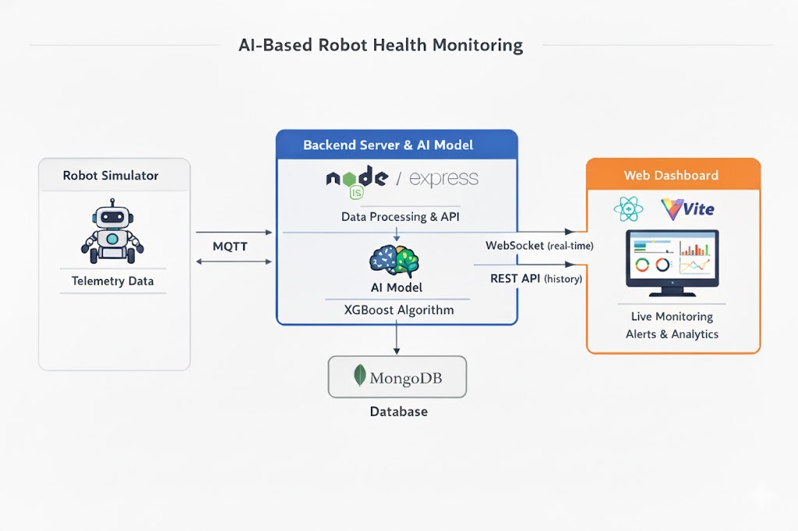

## 🤖 AI-Based Robot Health Monitoring

A real-time robot health monitoring platform combining IoT telemetry, MQTT communication, and AI-based anomaly detection using XGBoost.
The system continuously analyzes robot and system metrics to detect abnormal behavior and potential failures, visualized through an interactive web dashboard.

## 🎯 Project Objectives

-> Monitor robot health in real time

-> Detect early anomalies using AI and rule-based logic

-> Centralize telemetry data for maintenance and diagnostics

-> Provide role-based dashboards for administrators and maintenance engineers

-> Demonstrate a full end-to-end IoT + AI architecture

## 📊 Telemetry Monitored
# 🤖 Robot Metrics
- Battery level, health, drop rate, and degradation trend
- Motor temperature and current
# 🩺 Sensor Health
- Encoder status
- LiDAR status
- Camera status
# 💻 Embedded PC Metrics
- CPU usage
- Memory usage
- Disk usage
- Network activity
- System temperature
  
## 🧠 AI Anomaly Detection (XGBoost)
A trained XGBoost model performs pattern-based anomaly detection on incoming telemetry data:
*BATTERY_DEGRADATION
Detects long-term battery health decline patterns
*ABNORMAL_VELOCITY
Identifies unusual or unsafe speed behavior
*MOTOR_OVERHEATING
Predicts overheating risks based on temperature trends
*Other basic anomalies are handled using rule-based thresholds for fast detection.

## 🏗️ System Architecture
# 📁 Project Structure
   ```bash

ai-robot-health-monitoring
├── backend/                          # Node.js backend 
│   ├── config/
│   │   ├── index.js                  # App config
│   │   └── thresholds.js             # Thresholds & detection
│   ├── controllers/
│   │   ├── adminController.js        # Admin user management
│   │   ├── authController.js         # User login/registration
│   │   ├── engineerController.js     # Engineer profile
│   │   ├── mlController.js           # ML prediction
│   │   └── telemetryController.js    # Telemetry handling
│   ├── middlewares/
│   │   └── authMiddleware.js         # JWT authentication
│   ├── models/
│   │   ├── Telemetry.js              # Robot data schema
│   │   └── User.js                   # User schema
│   ├── routes/
│   │   ├── authRoutes.js             # Auth API routes
│   │   └── telemetryRoutes.js        # Telemetry API routes
│   ├── services/
│   │   ├── mlService.js              # Calls Python ML
│   │   ├── mqttService.js            # MQTT client
│   │   ├── socketService.js          # Socket.IO updates
│   │   ├── telemetryService.js       # Main processing logic
│   │   └── thresholdService.js       # Threshold management
│   ├── utils/
│   │   ├── generateToken.js          # JWT tokens
│   │   ├── hashPassword.js           # Password security
│   │   ├── initializeAdmin.js        # Creates admin user
│   │   └── logger.js                 # Console logging
│   ├── ml/
│   │   └── inference/
│   │       └── predict.py            # Python ML prediction
│   ├── .env                          # Environment secrets
│   ├── server.js                     # Main app entry point
│   └── package.json                  # Node.js dependencies
│
├── frontend/                         # React dashboard 
│   ├── src/
│   │   ├── api/                      # API client services
│   │   ├── components/               # Reusable UI components
│   │   │   ├── cards/                # Telemetry cards
│   │   │   ├── forms/                # Form components
│   │   │   ├── history/              # History & analytics
│   │   │   ├── panels/               # Dashboard panels
│   │   │   └── ui/                   # UI utility components
│   │   ├── pages/                    # Application pages
│   │   │   ├── Dashboard.tsx         # Main dashboard
│   │   │   ├── AlertsPage.tsx        # Alerts view
│   │   │   ├── AdminDashboard.tsx    # Admin management
│   │   │   ├── EngineerDashboard.tsx # Engineer monitoring
│   │   │   └── admin/                # Admin management pages
│   │   ├── layouts/                  # Layout wrappers
│   │   ├── routes/                   # Routing
│   │   ├── context/                  # Global state
│   │   ├── hooks/                    # Custom React hooks
│   │   ├── services/                 # External services
│   │   ├── config/                   # Configuration
│   │   ├── types/                    # TypeScript interfaces
│   │   ├── App.tsx
│   │   ├── main.tsx
│   │   └── index.css
│   ├── index.html
│   ├── tailwind.config.js
│   ├── postcss.config.js
│   ├── .env
│   ├── vite.config.ts
│   └── package.json
│
├── robot-simulator/                  # Python telemetry simulator 
│   ├── simulator.py                  # Publishes telemetry via MQTT
│   ├── requirements.txt
│   └── README.md
│
├── docs/                             # Documentation
│   └── architecture.png              # System architecture
│
├── .gitignore
└── README.md
```

## Architecture




The architecture shows how the robot simulator, backend, MQTT broker, AI model, and frontend dashboard communicate in real-time.

## 🚀 Getting Started

# 🔐 Environment Variables
This project requires environment variables for both the backend and frontend.
Create a .env file in each respective folder and configure the variables as shown below.
### Backend Environment (backend/.env)
Create a .env file in the backend/ folder:
   ```bash
MONGO_URI=your_mongodb_connection_string
MQTT_BROKER_URL=your_mqtt_broker_url
MQTT_TOPIC=your_mqtt_topic
PORT=5000
JWT_SECRET=your_jwt_secret
JWT_EXPIRES_IN=1d
```
# Frontend Environment (frontend/.env)
Create a .env file in the frontend/ folder:
   ```bash
VITE_API_URL=http://localhost:3000
VITE_SOCKET_URL=ws://localhost:3000
```

# ▶️ Running the Application
# Robot Simulator
1. Navigate to robot-simulator/
2.Install dependencies :
  ```bash
pip install -r requirements.txt
```
3. Run the simulator:
  ```bash
python simulator.py
```
## Backend Server
1. Navigate to `backend/`
2. Install dependencies:
   ```bash
   npm install
3. Start the server
   ```bash
   nodemon server.js
   ```
## Frontend Dashboard
1. Navigate to `frontend/`
2. Install dependencies:
  ```bash
   npm install
```
3. Start the dashboard
  ```bash
   npm run dev
```
🔐 After starting, you will be redirected to the login page.
Once you log in (as Admin or Maintenance Engineer), you will access the main dashboard with real-time telemetry and alerts.

## ✨Features

📡 Real-time telemetry monitoring

🧠 AI-powered anomaly detection using XGBoost

📊 Interactive dashboards and historical analytics

🔔 Alert system with filtering and severity levels

👥 Role-based access (Admin / Maintenance Engineer)

🔌 MQTT-based IoT communication

⚡ WebSocket live updates
